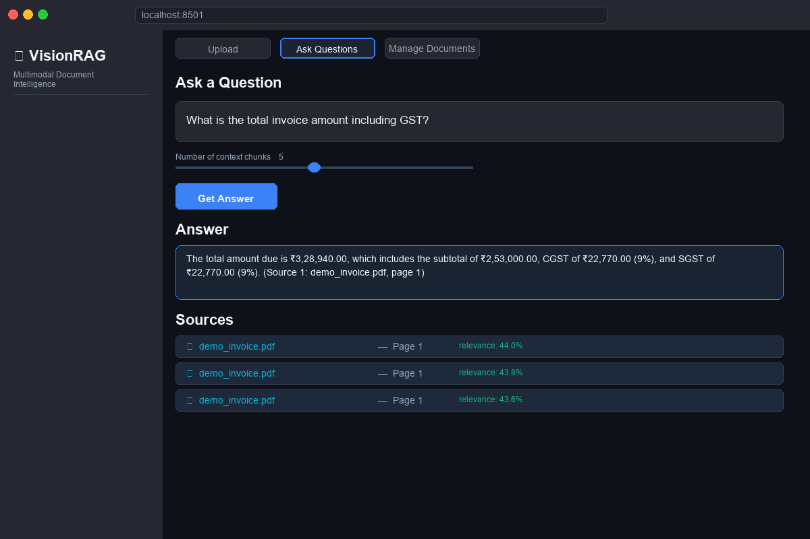
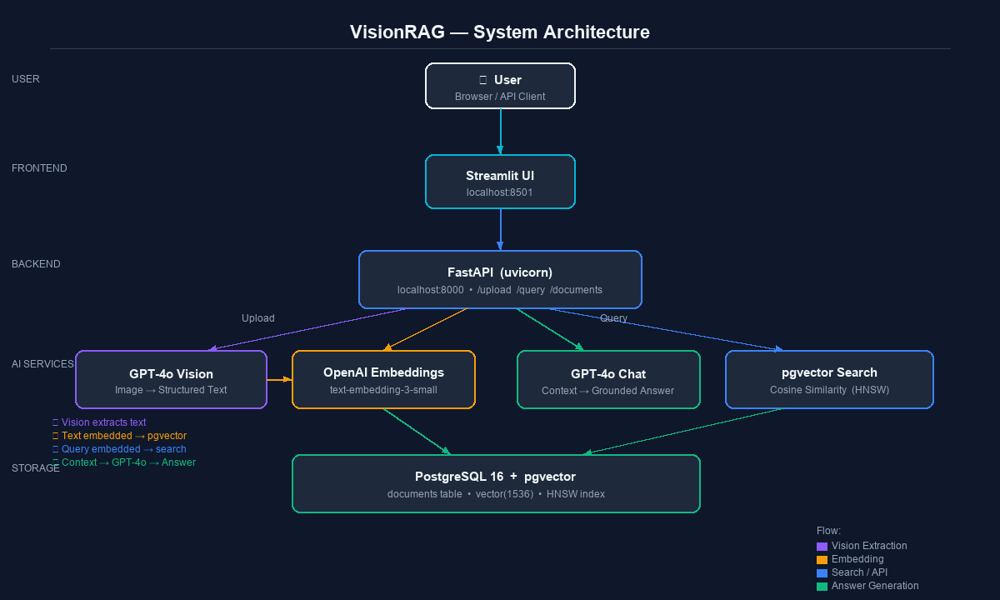

# VisionRAG

> Multimodal Document Intelligence — Extract, Embed, Query

Upload any image, scanned PDF, invoice, or screenshot. **GPT-4o Vision** extracts structured data from it. Embeddings are stored in **pgvector on PostgreSQL**. Ask natural language questions and get grounded answers with source citations — all through a clean FastAPI + Streamlit interface.

---

## UI



---

## Architecture



---

## Tech Stack

| Layer | Technology |
|-------|-----------|
| Vision LLM | GPT-4o Vision |
| Embeddings | OpenAI text-embedding-3-small |
| Vector DB | pgvector (PostgreSQL extension) |
| Database | PostgreSQL 16 |
| API | FastAPI |
| Frontend | Streamlit |
| PDF Processing | pdf2image, PyMuPDF |
| Container | Docker + docker-compose |

---

## Features

- Supports: scanned PDFs, images (PNG/JPG), screenshots, invoices, reports, forms
- GPT-4o Vision extracts text, tables, and key-value pairs
- pgvector for production-grade vector similarity search
- Multi-document support — query across all uploaded files
- Source citations — every answer shows which document/page it came from
- Streamlit UI for upload + Q&A
- REST API for programmatic access
- Dockerized PostgreSQL + pgvector — no external DB setup needed

---

## Project Structure

```
VisionRAG/
├── app/
│   ├── vision/
│   │   ├── __init__.py
│   │   ├── extractor.py        # GPT-4o Vision extraction
│   │   └── pdf_to_image.py     # PDF page renderer
│   ├── embeddings/
│   │   ├── __init__.py
│   │   └── embedder.py         # OpenAI embedding wrapper
│   ├── db/
│   │   ├── __init__.py
│   │   ├── schema.sql           # pgvector table schema
│   │   └── vector_store.py     # pgvector CRUD operations
│   ├── rag/
│   │   ├── __init__.py
│   │   └── chain.py            # Retrieval + generation chain
│   ├── api/
│   │   ├── __init__.py
│   │   └── routes.py           # FastAPI upload + query endpoints
│   └── main.py
├── frontend/
│   └── app.py                  # Streamlit UI
├── tests/
│   ├── test_extractor.py
│   └── test_vector_store.py
├── docker-compose.yml           # App + PostgreSQL + pgvector
├── Dockerfile
├── requirements.txt
├── .env.example
└── README.md
```

---

## Quick Start

```bash
git clone https://github.com/iampriyabrat14/VisionRAG
cd VisionRAG
cp .env.example .env           # fill in OpenAI key
docker-compose up --build      # starts app + postgres/pgvector
```

- API: `http://localhost:8000/docs`
- UI: `http://localhost:8501`

### Environment Variables

```env
OPENAI_API_KEY=your_key
POSTGRES_HOST=localhost
POSTGRES_DB=visionrag
POSTGRES_USER=postgres
POSTGRES_PASSWORD=postgres
```

---

## pgvector Schema

```sql
CREATE EXTENSION IF NOT EXISTS vector;

CREATE TABLE documents (
    id          SERIAL PRIMARY KEY,
    filename    TEXT,
    page_num    INT,
    content     TEXT,
    embedding   vector(1536),
    created_at  TIMESTAMP DEFAULT NOW()
);

CREATE INDEX ON documents
USING ivfflat (embedding vector_cosine_ops)
WITH (lists = 100);
```

---

## Supported Document Types

| Type | Examples |
|------|---------|
| Invoices | billing PDFs, receipts |
| Reports | annual reports, research papers |
| Forms | filled application forms, KYC docs |
| Screenshots | UI screenshots, dashboards |
| Medical | lab reports, prescriptions |

---

## Roadmap

- [ ] Batch upload support
- [ ] Table extraction into structured JSON
- [ ] Deploy to AWS ECS with RDS PostgreSQL
- [ ] Add reranker (cross-encoder) for better retrieval
- [ ] Export Q&A session as PDF report
